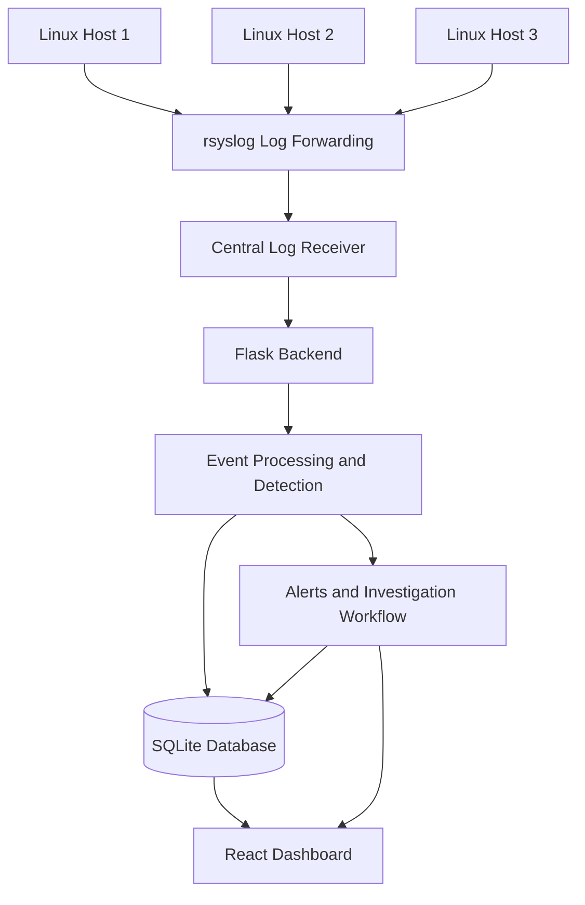

# FORENSIGHT

### Real-Time Log Analysis and Threat Detection System

**Forensight** is a Linux-focused security monitoring and threat detection system designed to centralize log collection, identify suspicious activity, and support security event investigation through a unified web dashboard.

The project combines Linux audit and system logs, configurable detection rules, a Python-based backend, and a React dashboard to provide visibility into security-relevant activity across monitored hosts.

It was built as a practical security engineering project exploring log aggregation, detection engineering, event processing, and analyst investigation workflows.

---

## Table of Contents

* [Overview](#overview)
* [Key Features](#key-features)
* [Architecture](#architecture)
* [Detection Capabilities](#detection-capabilities)
* [Investigation Workflow](#investigation-workflow)
* [Technology Stack](#technology-stack)
* [Deployment Model](#deployment-model)
* [Installation and Configuration](#installation-and-configuration)
* [Security Considerations](#security-considerations)
* [Limitations](#limitations)
* [Future Improvements](#future-improvements)
* [Author](#author)

---

## Overview

Security monitoring depends on collecting relevant telemetry, identifying suspicious behavior, and providing enough context to investigate potential threats. When logs remain distributed across individual hosts, correlating events and maintaining visibility becomes more difficult.

Forensight addresses this challenge by providing a centralized workflow for collecting Linux logs, processing security events, evaluating detection rules, and presenting resulting events and alerts to analysts.

The system was developed and tested in a Linux-based lab environment using multiple Ubuntu hosts.

### Project Objectives

* Centralize Linux log collection and provide visibility across monitored hosts.
* Detect suspicious activity using configurable rules and security event analysis.
* Present events and alerts through an interactive dashboard.
* Support investigation, assignment, tracking, and resolution of alerts.
* Automate aspects of log-forwarding setup and system configuration.
* Associate relevant detections with MITRE ATT&CK techniques to support threat analysis.

## Key Features

* **Centralized log collection:** Receive forwarded logs from monitored Linux hosts through `rsyslog`.
* **Security event detection:** Identify suspicious activity, including brute-force attempts, port scans, reverse-shell indicators, and privilege-escalation activity.
* **Configurable detection rules:** Define detection logic using YAML-based rule definitions.
* **Real-time dashboard updates:** Deliver event and alert updates to connected clients using Flask-SocketIO.
* **Alert investigation:** Track investigations, manage assignments, reopen cases, and record resolution notes.
* **Role-based access:** Support administrator, analyst, and viewer roles.
* **MITRE ATT&CK mapping:** Associate applicable detections with relevant adversary techniques.
* **Event and alert visualization:** Present security information through dashboard charts and severity summaries.
* **Data export:** Export relevant records in CSV format.
* **Deployment automation:** Use Bash scripts to automate aspects of the installation and configuration of log-forwarding components.

## Architecture

Forensight follows a centralized collection and analysis model. Monitored Linux hosts generate system, audit, and network-related events. Forwarded logs are received by the central application, processed by the backend, and made available through the dashboard.

### High-Level Data Flow

*Conceptual architecture; component boundaries and processing details should be confirmed against the final implementation.*

### Architecture Components

| Component             | Responsibility                                                                        |
| --------------------- | ------------------------------------------------------------------------------------- |
| Monitored Linux hosts | Generate system and security-relevant events.                                         |
| `rsyslog`             | Forward logs from monitored hosts to the central receiver.                            |
| Central log receiver  | Accept incoming forwarded log messages. The configured TCP listener uses port `5140`. |
| Flask backend         | Provide application services, process events, and expose the API.                     |
| Detection logic       | Evaluate incoming events against applicable detection rules.                          |
| SQLite                | Persist events, alerts, investigation records, and related metadata.                  |
| React dashboard       | Present security information and provide the analyst interface.                       |
| Bash automation       | Automate aspects of log-forwarding installation and configuration.                    |

### Event Processing

At a high level, the workflow is:

1. Monitored Linux systems generate logs and audit events.
2. `rsyslog` forwards configured log sources to the central receiver.
3. The backend processes incoming messages and extracts relevant event information.
4. Detection logic evaluates applicable events and produces alerts when configured conditions are satisfied.
5. Events and related records are persisted in SQLite.
6. The dashboard presents event and alert information for monitoring and investigation.

The precise parsing, normalization, deduplication, and rule-evaluation behavior depends on the implemented pipeline and detection rules.

## Detection Capabilities

Forensight focuses on identifying suspicious behavior through Linux telemetry and network-related events.

| Detection area         | Description                                                                                              |
| ---------------------- | -------------------------------------------------------------------------------------------------------- |
| Brute-force activity   | Identify patterns consistent with repeated authentication failures.                                      |
| Port scanning          | Detect network activity indicative of service or port enumeration.                                       |
| Reverse-shell activity | Identify event patterns associated with potential reverse-shell execution or connections.                |
| Privilege escalation   | Identify activity that may indicate attempts to obtain elevated privileges.                              |
| Sensitive file access  | Monitor configured security-sensitive paths, including `/etc/passwd`, `/etc/shadow`, and `/etc/sudoers`. |

These capabilities rely on the availability and quality of the relevant telemetry. A detection indicates potentially suspicious activity; it does not automatically establish that a host has been compromised.

### Linux Audit and Network Telemetry

Forensight incorporates Linux auditing and network-related event sources, including:

* **`auditd`:** Provides host-level audit events for configured system calls and sensitive file activity.
* **`rsyslog`:** Transports configured Linux log sources to the central receiver.
* **`iptables`:** Supplies relevant network events through the configured logging rules, including events associated with the `PORTSCAN_IN:` prefix.

Detection coverage depends on the host's logging configuration, enabled audit rules, network logging rules, and the detection logic applied by the application.

### MITRE ATT&CK Mapping

Forensight associates applicable detections with MITRE ATT&CK techniques to provide additional context for investigating suspicious activity.

ATT&CK mapping helps analysts understand the behavior a detection may represent and relate individual events to broader adversary tactics. A mapping is contextual information, not independent proof that a particular technique was successfully executed.

## Investigation Workflow

Beyond displaying alerts, Forensight includes functionality to support the management of security investigations.

### Alert Management

The application supports:

* Assigning and reassigning investigations.
* Reopening previously resolved investigations.
* Recording resolution notes.
* Maintaining investigation-related records and history.
* Reviewing alerts by severity and other available dashboard information.
* Exporting relevant records for further analysis.

These features are intended to make it easier to move from identifying a suspicious event to documenting and tracking its investigation.

### Access Control

Forensight implements three application roles:

| Role          | Purpose                                                       |
| ------------- | ------------------------------------------------------------- |
| Administrator | Administrative access to supported application functionality. |
| Analyst       | Access to supported monitoring and investigation workflows.   |
| Viewer        | Read-oriented access to supported application information.    |

The precise permissions assigned to each role are defined by the application's authorization logic.

## Technology Stack

| Component          | Purpose                                                                         |
| ------------------ | ------------------------------------------------------------------------------- |
| Python             | Core application logic, event processing, detection workflows, and automation.  |
| Flask              | REST API and core backend application services.                                 |
| Flask-SQLAlchemy   | ORM-based database models and persistence layer.                                |
| Flask-JWT-Extended | JWT-based authentication and authorization.                                     |
| Flask-SocketIO     | Real-time event and alert delivery to connected dashboard clients.              |
| SQLite             | Persistent storage for events, alerts, investigations, and associated metadata. |
| React              | Interactive analyst dashboard and user interface.                               |
| Bash               | Automation of log-forwarding setup and system configuration.                    |
| `rsyslog`          | Centralized forwarding of Linux system and application logs.                    |
| `auditd`           | Host-level auditing and collection of security-relevant system events.          |
| `iptables`         | Generation of relevant network security events.                                 |
| YAML               | Declarative configuration of detection rules and associated conditions.         |

## Deployment Model

Forensight was designed around a small, centralized Linux monitoring environment.

The lab architecture uses multiple Ubuntu hosts to generate telemetry and a central system to receive, process, store, and display events.

The central application combines the backend, database, and dashboard components. Monitored hosts require appropriate log-forwarding configuration and the relevant event sources for the detections being evaluated.

Bash automation supports aspects of the setup process, reducing the need to configure every log-forwarding component entirely by hand.

## Installation and Configuration

> **Status:** The exact installation commands, script names, and environment variables need to be confirmed against the current repository.

### Prerequisites

The expected environment includes:

* A supported Linux environment for the backend and log receiver.
* Python and the project's backend dependencies.
* Node.js and npm for the React frontend.
* SQLite for application data persistence.
* `rsyslog` on systems that forward logs.
* `auditd` and appropriate network logging configuration for the relevant detection sources.
* Network connectivity between monitored hosts and the central receiver.

### Setup Overview

The deployment process is expected to follow these stages:

1. Clone the repository.
2. Configure the Python backend environment and install its dependencies.
3. Configure the frontend dependencies.
4. Set the required environment variables and application configuration.
5. Initialize the application database using the project's supported initialization procedure.
6. Configure log-forwarding and relevant telemetry on monitored Linux hosts.
7. Configure the central receiver and ensure that its listening port is reachable from authorized hosts.
8. Start the backend and frontend using the project's documented development or deployment commands.
9. Generate test events and verify that they are received, processed, and displayed as expected.

**Before running the application**, consult the repository's actual configuration and scripts. Commands, service names, credentials, and database initialization steps should be documented only after they have been verified.

## Security Considerations

Forensight is a security monitoring project, and its deployment should follow basic security practices.

* Restrict access to the log receiver to authorized hosts and networks.
* Use secure configuration for JWT signing keys, application secrets, and credentials.
* Avoid committing `.env` files, private keys, tokens, or sensitive log data to source control.
* Apply appropriate permissions to log files, configuration files, and the SQLite database.
* Protect the dashboard and backend with suitable network controls.
* Use synthetic events or an authorized lab environment when testing detection behavior.
* Validate detection rules against benign and suspicious test cases to understand false positives and coverage gaps.

The implementation should not be assumed to provide production-grade security solely because it includes authentication, authorization, or detection features. Deployment security depends on the configuration, code, and operating environment.

## Limitations

Forensight is a practical project developed in a controlled Linux lab environment. Its current scope and effectiveness depend on the event sources, detection rules, and deployment configuration.

Potential limitations to consider include:

* Detection quality depends on the telemetry available from monitored hosts.
* Rule-based detections can produce false positives and may miss activity that does not match configured conditions.
* Coverage is limited to the event sources and behaviors explicitly supported by the implementation.
* SQLite and a small centralized deployment may require architectural changes as event volume and concurrent usage increase.
* Detection effectiveness must be validated through repeatable tests rather than inferred from the presence of a rule.

These limitations should be refined as the implementation and testing results are documented.

## Future Improvements

Potential areas for further development include:

* Expanded detection coverage and rule testing.
* Improved event correlation across multiple hosts.
* More detailed alert context and investigation timelines.
* Automated regression testing for detection rules.
* Additional event sources and normalization support.
* Deployment hardening, monitoring, and operational documentation.
* Performance and scalability improvements for larger environments.

This roadmap is indicative; items can be removed or updated to reflect the project's actual development plans.

## Author

**Charles Mwangi Kamau**

Software Engineering graduate focused on cybersecurity, security operations, digital forensics, and security-focused software development.

* **GitHub:** [33Charles](https://github.com/33Charles)
* **Project repository:** [33Charles/forensight](https://github.com/33Charles/forensight)

---

*Forensight is a practical security engineering project intended for authorized monitoring, security testing, and educational use.*
