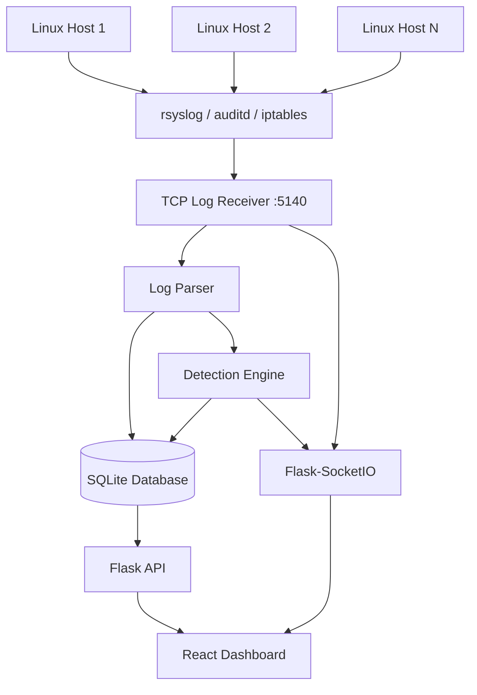
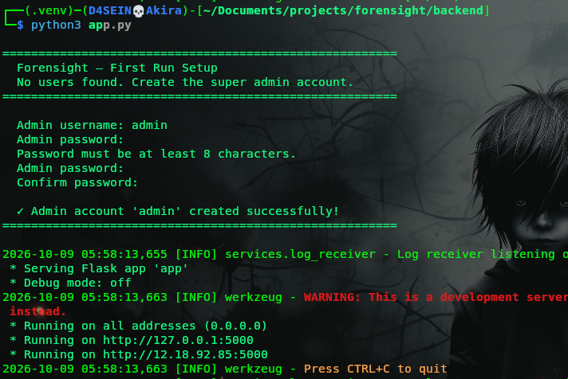

# FORENSIGHT

### Real-Time Linux Log Analysis and Threat Detection System

Forensight is a lightweight, Linux-focused security monitoring and threat detection system designed to centralize system logs, identify suspicious activity, and support security investigations through a real-time web dashboard.

Built with Python, Flask, React, and SQLite, Forensight collects forwarded logs from Linux hosts, analyzes events against configurable detection rules, and presents potential security threats with severity classifications, investigation workflows, and MITRE ATT&CK context.

> **Project status:** Security monitoring and investigation prototype developed and tested in a lab environment. It is intended for learning, experimentation, and demonstration, not as a replacement for a production-grade SIEM.

## Table of Contents

* [Overview](#overview)
* [Key Features](#key-features)
* [Architecture](#architecture)
* [Detection Capabilities](#detection-capabilities)
* [Investigation Workflow](#investigation-workflow)
* [Technology Stack](#technology-stack)
* [Project Structure](#project-structure)
* [Requirements](#requirements)
* [Installation](#installation)
* [Configuring Linux Log Sources](#configuring-linux-log-sources)
* [Accessing the Dashboard](#accessing-the-dashboard)
* [Historical Log Analysis](#historical-log-analysis)
* [Security and Access Control](#security-and-access-control)
* [Configuration](#configuration)
* [Known Limitations](#known-limitations)
* [Future Improvements](#future-improvements)
* [Author](#author)

## Overview

Modern Linux environments generate valuable security telemetry through authentication services, system logs, audit frameworks, and network activity. However, reviewing these logs individually can make it difficult to recognize suspicious patterns and investigate related events.

Forensight addresses this problem by collecting logs from configured Linux sources, parsing supported log formats, applying detection rules, and presenting suspicious activity through a centralized interface.

The system combines real-time log ingestion with historical log analysis, enabling security practitioners to examine potential threats, investigate alerts, document findings, and track event status.

### Project Objectives

* Centralize log collection from multiple Linux hosts.
* Detect suspicious authentication and system activity.
* Identify potential privilege escalation and unauthorized file access.
* Monitor audit-recorded outbound connections and firewall-logged inbound scanning activity.
* Provide real-time updates through a web dashboard.
* Support structured alert investigation and audit history.
* Map detected events to relevant MITRE ATT&CK techniques and tactics for investigative context.

## Key Features

### Centralized Log Collection

* Receives forwarded log messages over TCP.
* Integrates with `rsyslog` and Linux `auditd`.
* Supports authentication, privilege-related, system, audit, and firewall log events covered by its parser.
* Stores parsed log entries and their raw messages for later review.

### Rule-Based Threat Detection

* Detects repeated SSH authentication failures.
* Identifies SSH attempts targeting the root account.
* Flags suspicious sudo activity and potential privilege escalation.
* Monitors access attempts involving sensitive system files.
* Detects potential inbound and outbound port-scanning activity.
* Identifies shell processes making suspicious outbound connections.
* Uses configurable YAML rules for detection thresholds, severity, and MITRE ATT&CK context.

### Real-Time Security Dashboard

* Receives live log and suspicious-event updates through Socket.IO.
* Displays events by severity, type, status, and host.
* Provides security statistics and event timelines.
* Highlights frequently observed source IP addresses and targeted usernames.
* Supports viewing individual logs and related events.

### Alert Investigation and Case Tracking

* Assign events to active users.
* Move alerts between open, investigating, and resolved states.
* Record investigation notes.
* Reassign alerts when investigation ownership needs to change.
* Reopen previously resolved events.
* Maintain an event audit trail containing actions, timestamps, users, and details.

### Historical Log Analysis

* Upload supported log files for analysis through the authenticated API.
* Store imported records separately from live-ingested records using a source label.
* Apply the detection logic to supported historical log entries.
* Review the resulting events alongside live monitoring data.

### User and Access Management

* JWT-based authentication.
* Bcrypt password hashing.
* Admin, analyst, and viewer roles.
* Administrative user creation, updating, disabling, and deletion.
* Access and refresh tokens with configurable lifetimes.

### Data Export

* Export dashboard-provided tabular data as CSV files using a frontend utility.

## Architecture

Forensight uses a centralized collection architecture. Configured Linux hosts forward logs to the monitoring server, where the backend parses and analyzes incoming messages before storing the resulting records.




### Event Processing

1. Configured Linux systems forward supported log messages to the monitoring server.
2. The TCP receiver accepts incoming connections and processes newline-delimited log messages.
3. The parser extracts fields such as timestamps, hostnames, processes, usernames, and network details where supported.
4. The detection engine evaluates parsed records against enabled rules and its tracking state.
5. The backend stores log entries and, when a suspicious event is detected, records the event and its creation audit entry.
6. The dashboard receives live `log_entry` and `suspicious_event` Socket.IO notifications.
7. Analysts investigate events through the authenticated REST API and web interface.

## Detection Capabilities

The detection engine evaluates patterns across supported Linux authentication, audit, system, and firewall logs.

| Detection                       | Description                                                                                                         | Example MITRE ATT&CK context                                           |
| ------------------------------- | ------------------------------------------------------------------------------------------------------------------- | ---------------------------------------------------------------------- |
| SSH brute-force activity        | Repeated failed SSH authentication attempts from the same source and username within a configured time window.      | T1110 — Brute Force                                                    |
| Root login attempts             | SSH authentication attempts targeting the root account.                                                             | T1078 — Valid Accounts, depending on the activity and mapping          |
| Brute-force success             | A successful SSH login following recent failed attempts for the same source and username.                           | T1110 — Brute Force                                                    |
| Sudo authentication failures    | Repeated sudo authentication failures.                                                                              | T1548.003 — Sudo and Sudo Caching                                      |
| Unauthorized sudo activity      | Attempts to use sudo when the user is not authorized by the sudoers configuration.                                  | T1548.003 — Sudo and Sudo Caching                                      |
| Privilege escalation indicators | Potential root-shell spawning, sudoers modification, privileged-group changes, user creation, and password changes. | T1548 — Abuse Elevation Control Mechanism                              |
| Sensitive file access           | Access involving configured sensitive paths such as `/etc/shadow`, `/etc/sudoers`, and SSH configuration files.     | Credential-access context; the exact technique depends on the activity |
| Unauthorized file access        | Permission-denied file access attempts matching configured audit rules.                                             | T1083 — File and Directory Discovery, where applicable                 |
| Port scanning                   | Multiple destination ports observed in outbound audit events or inbound firewall logs within a configured window.   | T1046 — Network Service Discovery                                      |
| Potential reverse shell         | A shell or scripting process making a suspicious outbound connection.                                               | T1059 — Command and Scripting Interpreter, as contextual mapping       |
| Repeated outbound connections   | Repeated connections to the same destination IP within a configured period.                                         | T1071 — Application Layer Protocol, where applicable                   |

**Important:** These detections identify suspicious indicators, not definitive proof of compromise. MITRE ATT&CK mappings provide investigative context and should be validated against the underlying evidence.

### Default Detection Thresholds

The supplied configuration includes the following default values. They can be adjusted in `backend/detection_rules.yaml`.

| Rule                                   | Default threshold or window                                  |
| -------------------------------------- | ------------------------------------------------------------ |
| SSH brute-force detection              | 5 medium, 10 high, 20 critical failures within 60 seconds    |
| Sudo authentication failures           | 3 failures within 60 seconds                                 |
| Outbound port scanning                 | 15 unique destination ports within 10 seconds                |
| Inbound port scanning                  | 5 unique destination ports within 10 seconds                 |
| Repeated outbound connections          | 10 connections to the same destination IP within 300 seconds |
| Sensitive file access deduplication    | 10 seconds                                                   |
| Unauthorized sudo deduplication        | 10 seconds                                                   |
| Unauthorized file access deduplication | 30 seconds                                                   |

Actual alert behavior depends on rule enablement, parser output, available telemetry, deduplication, and the detector's tracking logic.

## Investigation Workflow

Forensight provides a structured investigation lifecycle for suspicious events.

1. **Detection:** A matching rule generates a suspicious event with severity, descriptive context, and available source details.
2. **Review:** An authorized user examines the alert and its associated log records.
3. **Assignment:** An analyst can assign an unassigned alert to themselves. Administrators can assign alerts to active users, reassign existing alerts, and change ownership when necessary.
4. **Investigation:** The assigned analyst moves the alert into the investigating state and documents findings through investigation notes.
5. **Resolution:** The investigator resolves the alert, recording the resolution actor and timestamp.
6. **Audit review:** Authorized users can inspect the event's audit trail to review recorded actions, timestamps, and responsible users.
7. **Reopening and reassignment:** Resolved alerts can be reopened by authorized users under the application's ownership rules. Administrators can also force-reassign an alert under investigation, returning it to the open state before changing its assignment.

The workflow uses role-based permissions and ownership checks to help maintain accountability throughout the investigation process.


## Technology Stack

### Backend

* **Python** — application logic and log processing.
* **Flask** — REST API and application framework.
* **Flask-SQLAlchemy / SQLAlchemy** — database access and ORM.
* **Flask-SocketIO** — real-time event delivery.
* **Flask-JWT-Extended** — access and refresh token authentication.
* **bcrypt** — password hashing.
* **PyYAML** — detection-rule configuration.
* **SQLite** — local database storage.
* **Python sockets and threading** — TCP log reception and concurrent client handling.

### Frontend

* **React** — user interface.
* **Vite** — development server and build tooling.
* **React Router** — client-side routing.
* **Tailwind CSS** — interface styling.
* **Recharts** — charts and analytics.
* **Axios** — REST API requests.
* **Socket.IO Client** — real-time event updates.
* **Lucide React** — interface icons.

### Linux Log Sources

* `rsyslog` — log forwarding.
* `auditd` — audit telemetry and syscall-related events.
* `iptables` — firewall logging for configured inbound scanning indicators.
* Bash — log-source configuration automation.

## Project Structure

The following is a simplified overview of the project's main components.

```text
forensight/
├── backend/
│   ├── app.py
│   ├── config.py
│   ├── requirements.txt
│   ├── detection_rules.yaml
│   ├── api/
│   │   ├── routes.py
│   │   ├── auth_routes.py
│   │   └── user_routes.py
│   ├── database/
│   │   └── db.py
│   ├── models/
│   │   ├── log_entry.py
│   │   └── user.py
│   └── services/
│       ├── auth.py
│       ├── config_loader.py
│       ├── detector.py
│       ├── log_parser.py
│       └── log_receiver.py
├── frontend/
│   ├── package.json
│   └── src/
│       ├── hooks/
│       │   └── useSocket.js
│       └── utils/
│           ├── api.js
│           ├── export.js
│           └── helpers.js
└── ...
```

*This tree highlights the files reviewed during documentation; it is not intended to list every file in the repository.*

## Requirements

* A Linux development or monitoring system.
* Python 3 with virtual environment support.
* Node.js and npm.
* Network connectivity between configured log sources and the monitoring server.
* TCP port `5140` reachable from log sources.
* TCP port `5000` available for the Flask-SocketIO application.
* `rsyslog`, `auditd`, and `iptables` on source hosts, as required by the setup script.
* Sufficient permissions to configure logging, audit rules, and firewall logging on source hosts.

The supplied source-setup script targets Debian/Ubuntu-style systems using `apt-get` and systemd. Other distributions may require changes.

## Installation

### 1. Clone the repository

```bash
git clone https://github.com/33Charles/forensight.git
cd forensight
```

### 2. Configure the backend dependencies

```bash
cd backend

python3 -m venv .venv
source .venv/bin/activate

python -m pip install --upgrade pip

pip install -r requirements.txt
```

### 3. Configure application secrets

The application currently has a development fallback for `SECRET_KEY`. Set a strong, unique secret before running it outside a disposable lab environment.

For example:

```bash
export SECRET_KEY="$(python -c 'import secrets; print(secrets.token_hex(32))')"
```

`JWT_SECRET_KEY` defaults to `SECRET_KEY` if it is not set separately. If you choose separate secrets, configure both appropriately.

Do not commit real secrets to version control.

### 4. Start the backend

From the `backend/` directory, with the virtual environment activated:

```bash
python app.py
```

On first startup, if the database contains no users, the application prompts you to create the initial administrator account. The username must be at least three characters long and the password at least eight characters long.

The application initializes its database and starts the TCP log receiver on the configured host and port, followed by the Flask-SocketIO application on port `5000`.

### 5. Install and build the frontend

Open another terminal:

```bash
cd frontend
npm install
npm run build
```

For frontend development, use:

```bash
npm run dev
```

The Axios client and Socket.IO hook use relative paths (`/api` and `/`). Configure the Vite development proxy or the appropriate deployment routing so these requests reach the backend. The exact proxy configuration should be verified in `vite.config.*`.

A frontend build alone does not establish that production routing, authentication, and WebSocket forwarding are correctly configured.

## Configuring Linux Log Sources

Forensight includes a Bash setup script for configuring a supported Linux source to forward selected logs to the monitoring server.

### 1. Configure the monitoring server address

Before executing the script, edit the server address variable:

```bash
FORENSIGHT_SERVER="10.86.160.1"
FORENSIGHT_PORT="5140"
```

Replace the example address with the actual reachable IP address of your Forensight server.

Ensure that the monitoring host allows inbound TCP traffic on port `5140` from authorized source hosts.

### 2. Review the setup script

The script can:

* Install `rsyslog` and `auditd` when required.
* Configure forwarding of selected authentication, sudo, audit-dispatcher, system, and firewall messages.
* Enable supported audit log forwarding.
* Configure audit rules for sensitive files, account-management binaries, permission-denied file access, and outbound connection syscalls.
* Configure rate-limited firewall log rules for selected inbound TCP SYN and UDP traffic.
* Validate the rsyslog configuration and perform a basic TCP connectivity test.

**Review the entire script before running it as root.** It changes host logging, audit, service, and firewall configuration. Verify its compatibility with your distribution and existing security policies.

### 3. Run the script

Use the actual filename in your repository. For example:

```bash
sudo bash ./path/to/log-source-setup.sh
```

Repeat the configuration on each Linux host you want to monitor.

### 4. Verify log delivery

Check that the required services are running on the source and that the source can reach the monitoring server on TCP port `5140`.

The setup script's connectivity check verifies basic TCP reachability; it does not prove that every log format is parsed correctly or that every detection rule generates the expected alert.

## Accessing the Dashboard

Once the frontend and backend are configured and running, open the frontend URL supplied by your development server or deployment.

Sign in with the initial administrator account created during first-run setup.

Depending on the deployment and frontend routing, the dashboard communicates with the backend through:

* REST endpoints under `/api`.
* JWT Bearer authentication for API requests.
* Socket.IO events named `log_entry` and `suspicious_event` for real-time updates.

Do not expose the development server directly to untrusted networks.

## Historical Log Analysis

Forensight supports uploading a log file through the authenticated `POST /api/ingest` endpoint using multipart form data with a `file` field.

The backend processes supported non-empty lines, attempts to parse them, stores accepted records with a historical source label, and runs the detection engine against parsed entries.

A successful response includes counts for processed lines, saved entries, generated alerts, and line-level processing errors.

Example request:

```bash
curl -X POST http://localhost:5000/api/ingest \
  -H "Authorization: Bearer YOUR_ACCESS_TOKEN" \
  -F "file=@sample.log"
```

Replace `YOUR_ACCESS_TOKEN` with a valid access token and `sample.log` with a test log file.

Historical detection results should be interpreted in context. Detection outcomes can depend on the supported log format, the order of records, and the detector's in-memory state.

## Security and Access Control

### Role-Based Permissions

| Capability                    | Admin | Analyst | Viewer |
| ----------------------------- | :---: | :-----: | :----: |
| View logs and events          |  Yes  |   Yes   |   Yes  |
| Update event status and notes |  Yes  |   Yes   |   No   |
| Manage users                  |  Yes  |    No   |   No   |
| Assign or reassign events     |  Yes  |    No   |   No   |
| Ingest historical logs        |  Yes  |   Yes   |   No   |
| Reload detection rules        |  Yes  |    No   |   No   |

Event-specific ownership checks may further restrict which users can modify an investigation.

### Authentication

* Passwords are stored as bcrypt hashes.
* Access tokens expire after eight hours by default.
* Refresh tokens expire after 30 days by default.
* The API returns authentication errors for missing, invalid, or expired access tokens.
* The frontend clears its stored access token and redirects to login after an HTTP `401` response.

The current logout endpoint is stateless: it does not revoke a token server-side. A discarded token can remain valid until expiration unless additional revocation controls are implemented.

### Deployment Precautions

Before using Forensight outside an isolated lab:

* Replace the development secret with a strong environment-provided secret.
* Restrict Flask CORS and Socket.IO origins to trusted frontend origins. The current reviewed configuration permits broad origins.
* Deploy behind a suitable production WSGI/Socket.IO setup with HTTPS and WebSocket proxy support.
* Restrict TCP port `5140` to authorized log sources using host or network firewall rules.
* Avoid exposing the log receiver or database directly to the public internet.
* Add input validation and upload-size limits for historical ingestion.
* Consider backups, database retention, and monitoring-server access controls.
* Review the audit-log design and enforce append-only integrity if tamper resistance is required.

## Known Limitations

* **Linux-focused telemetry:** The current implementation is designed around Linux logging and audit sources; it is not a general Windows endpoint monitoring platform.
* **Parser coverage:** Only supported log formats and fields are reliably parsed. Unrecognized messages may be skipped or classified generically.
* **Detection accuracy:** Rule-based indicators can generate false positives and may miss activity that is not represented in the collected telemetry.
* **Network visibility:** Connection and scan detections depend on the audit and firewall rules configured on source systems.
* **Local storage:** SQLite is suitable for a lab prototype but may become a bottleneck as concurrent writes and event volume grow.
* **In-memory detection state:** Some detections rely on in-memory counters and tracking windows, so process restarts and historical ingestion can affect correlation behavior.
* **Timestamp assumptions:** The application uses UTC-oriented timestamps, but timestamp parsing and browser-side timezone conversion should be validated across log formats and deployments.
* **Transport security:** TCP log forwarding as configured does not itself provide encrypted or authenticated log transport.
* **Token revocation:** Logout does not currently invalidate issued JWTs on the server.
* **Production readiness:** The current development launch configuration, permissive cross-origin settings, and development secret fallback require hardening before production use.

## Future Improvements

Potential next steps include:

* Persistent detection state and more robust event correlation.
* Better parser coverage, including additional Linux distributions and log formats.
* Detection testing with reproducible attack simulations and known-good baselines.
* More comprehensive timestamp normalization and event deduplication.
* Configurable event retention and database backup procedures.
* Improved ingestion validation, upload limits, and error reporting.
* Token revocation and stronger session management.
* Production deployment configuration with restricted origins and encrypted transport.
* More scalable storage for higher-volume environments.
* Automated tests for detection rules, API permissions, and investigation workflows.
* Additional evidence enrichment and clearer analyst guidance for each detection.

## Author

**Charles Mwangi Kamau**

* GitHub: [@33Charles](https://github.com/33Charles)
* Project repository: [33Charles/forensight](https://github.com/33Charles/forensight)

Forensight was developed as a practical project exploring Linux log collection, security event analysis, rule-based threat detection, and security investigation workflows.
